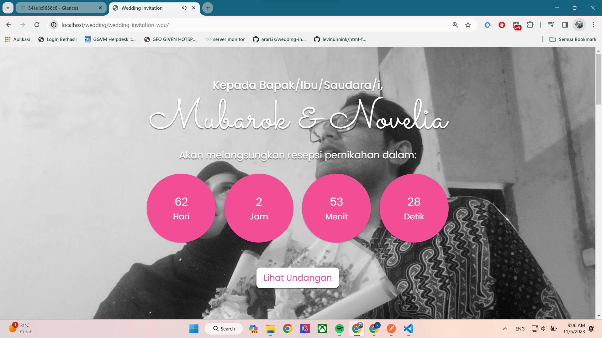

<!-- <p align="center"> -->
<!-- <a> -->
\
<!-- </a> -->
<!-- </p> -->

# Wedding Invitation 

Create a wedding invitation website with HTML, CSS & BOOTSTRAP 5.

# variable get
```
http://yourhost/?p="pangkat"&&n="nama"